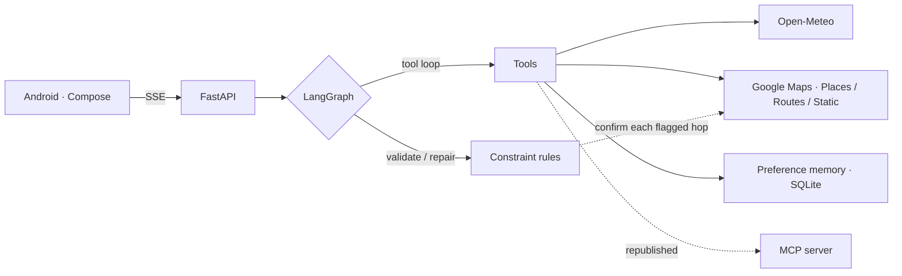

# Wandergent

A travel-planning agent that turns a sentence into a feasible itinerary — and checks its own work.

> *"3 days in Los Angeles next month, budget $900, I like food and museums, no hiking"*
> → resolves the dates → checks the forecast → puts the Getty on the day it rains and the pier on
> the day it does not → validates budget, time conflicts and travel time between places →
> streams the whole process to an Android app.

Python + FastAPI + LangGraph backend, Kotlin + Jetpack Compose client, tools published over MCP.

<!-- TODO: add a demo GIF of the streaming UI here -- it is the single most persuasive thing on this page. -->

---

## Why it is interesting

**The model does not get the last word.** Generated itineraries are checked by code — budget arithmetic, overlapping activities, travel time between places — and violations are fed back for repair. **The repair is then re-validated**, because a model saying it fixed something is not evidence.

**Costs cannot be faked.** Day and trip totals are Pydantic computed fields derived from the activities, so the model cannot make a plan look in-budget by mis-adding.

**Failure is data, not an exception.** Tools never raise; they return a typed degraded result the agent can plan around. A dead weather API produces a plan with a caveat, not a 500.

**Portable by construction.** The itinerary is plain JSON validated with Pydantic rather than provider-specific structured outputs — switching the whole system from OpenAI to Xiaomi MiMo took two env vars and zero code.

## Measured results

Each row is one change and what it did, with the date it was measured. They are deltas, not a
description of today's totals: the eval set has grown since (a revision case now runs two plans
per case), so the absolute figures describe the subset as it stood on that date.

| Change | Effect | Measured |
|---|---|---|
| Moved the itinerary schema into the system prompt — streaming is what exposed the stall | latency **57.6 s → 42.2 s (-27%)**, first place name at 22.8 s instead of 40.2 s | 2026-08-05 |
| Pruned the JSON schema shipped on every call | **13 → 9** LLM calls, **54k → 31k** tokens (-42%), eval checks unchanged at 16/16 | 2026-08-05 |
| Fast path: parse the turn that ends the tool loop as a candidate itinerary, instead of always running a separate emit stage | **3 → 2** LLM calls on the common path | 2026-08-05 |
| Taught the transfer rule that "X" and "a place near X" are the same place | 6 route false positives → **1**, and that one was genuine | 2026-08-05 |
| Built dynamic model routing, then measured it | **left off** — the effect was not separable from run-to-run noise | 2026-08-05 |

Every number came from the eval harness or a traced live run, not an estimate; the reasoning and
the rejected alternatives behind each are in [`docs/decisions.md`](docs/decisions.md).

**Today**: 440 offline backend tests · 1 MCP protocol test · 59 Android unit tests · 8 LLM eval
cases. The eval set is not currently passing in full — the constraint work it measures is still
in progress.

## Architecture



The graph has seven nodes and three cycles: `gather → run_tools → gather` (bounded), `parse → emit → emit` (one retry), and `validate → repair → validate`. Routing lives in small predicate functions; the nodes only do work.

The dotted edge back to Routes is the part worth noticing: the constraint layer's travel-time rule is a string heuristic that only *proposes*. Every hop it flags is then confirmed against a real route, measured at the hour the traveller actually sets off — so a failure to measure keeps the original verdict rather than clearing it.

MCP is a **second surface, not a replacement** — the agent keeps calling tools in-process, so no JSON-RPC round trip is added inside one process and per-request identity survives. The memory tool is deliberately not published, because that surface has no authenticated user.

## Quickstart

Requires Python ≥ 3.11 and [uv](https://docs.astral.sh/uv/). No interpreter is pinned; uv reuses the one you have.

```bash
cd backend
uv sync
cp .env.example .env        # then put your key in OPENAI_API_KEY
uv run uvicorn app.main:app --reload
```

`GET /health` answers without a key. Planning needs one.

```bash
uv run pytest -q                        # 440 offline tests, no key needed
uv run python -m scripts.smoke_plan     # live end-to-end run (costs tokens)
uv run python -m evals.run              # LLM regression eval (costs tokens)
```

Android:

```powershell
cd android
# Point JAVA_HOME at a JDK 17+; Android Studio's bundled JBR works and needs no install.
$env:JAVA_HOME="<your Android Studio>/jbr"
.\gradlew.bat installDebug
adb reverse tcp:8000 tcp:8000           # re-run after every unplug
```

Put your SDK path in `android/local.properties` (gitignored) as `sdk.dir=...`. The USB
tunnel is why the app targets `127.0.0.1` — no shared Wi-Fi and no inbound firewall rule.

## API

`POST /plan/stream` (SSE) is the primary path; `POST /plan` is the non-streaming fallback, and the
client degrades to it if the stream produces nothing. Full contract, dumped from the running app rather than
written from memory: [`docs/api.md`](docs/api.md).

## Status

Phases 1–3 are done and verified on a physical device: weather, Google Places and Routes tools,
streaming, constraint validation, preference memory, MCP, accounts and a shared-trip feed. Phase 4
(observability, caching, deploy) is in progress — Docker and compose have landed.

## Docs

| | |
|---|---|
| [`docs/decisions.md`](docs/decisions.md) | Every design decision, with the reasoning and the gotchas |
| [`docs/api.md`](docs/api.md) | The client contract, dumped from the running app |

## License

MIT — see [LICENSE](LICENSE).
