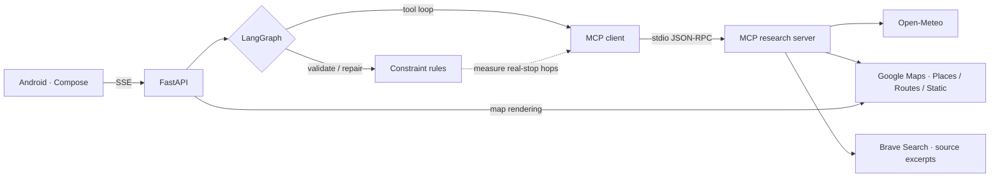

# Wandergent

A travel-planning agent that turns a sentence into a feasible itinerary — and checks its own work.

> *"3 days in Los Angeles next week, budget $900, I like food and museums, no hiking"*
> → resolves the dates → checks the forecast → puts the Getty on the day it rains and the pier on
> the day it does not → validates budget, time conflicts and travel time between places →
> streams the whole process to an Android app.

Python + FastAPI + LangGraph backend, Kotlin + Jetpack Compose client, tools published over MCP.

Planning uses the vendored [Travel Planner skill](backend/skills/travel-planner/SKILL.md)
for intake, pace, daily rhythm, fatigue, budget guidance, preparation and itinerary review.
Wanderlog execution is disabled. Android displays the guide and daily backup options;
saved plans, revisions and shared trips retain them. Existing code still verifies costs,
opening hours, request-owned bookings and routes after generation and repair.

The skill is stateless: planning uses the current request and current trip context,
without reading or writing durable preferences. **You → Saved preferences** remains
available to view and delete old records; those records no longer shape new plans.

Set `BRAVE_SEARCH_API_KEY` on the server for web research beyond Maps and weather.
Search results include source URLs, excerpts and collection times. Excerpts are partial
evidence, not verified availability or full-page review. Missing configuration or failed
queries return explicit research gaps. No additional Python dependency is required.

<!-- TODO: add a demo GIF of the streaming UI here -- it is the single most persuasive thing on this page. -->

---

## Why it is interesting

**The model does not get the last word.** Generated itineraries are checked by code — budget arithmetic, overlapping activities, travel time between places — and violations are fed back for repair. **The repair is then re-validated**, because a model saying it fixed something is not evidence.

**The request remains the authority.** Budget, ISO dates, duration, party size and allowed travel modes are kept outside the generated itinerary and checked after every generation and repair. A model cannot make a plan pass by raising its own budget field or switching a walking leg to a car.

**Costs cannot be faked.** Day and trip totals are Pydantic computed fields derived from the activities, so the model cannot make a plan look in-budget by mis-adding.

**Failure is data, not an exception.** Tools never raise; they return a typed degraded result the agent can plan around. A dead weather API produces a plan with a caveat, not a 500.

**Feedback becomes reviewed regression data.** Signed-in travellers can rate a whole plan or one activity. The server retains only an allowlisted, text-free structural snapshot for 30 days; exported reports remain untrusted until a person reproduces the issue as a test or eval case.

**Portable by construction.** The itinerary is plain JSON validated with Pydantic rather than provider-specific structured outputs — switching the whole system from OpenAI to Xiaomi MiMo took two env vars and zero code.

## Measured results

Each row is one change and what it did, with the date it was measured. They are deltas, not a
description of today's totals: the eval set has grown since (a revision case now runs two plans
per case), so the absolute figures describe the subset as it stood on that date.

| Change | Effect | Measured |
|---|---|---|
| Moved the itinerary schema into the system prompt — streaming is what exposed the stall | latency **57.6 s → 42.2 s (-27%)**, first place name at 22.8 s instead of 40.2 s | 2026-08-05 |
| Pruned the JSON schema shipped on every call | **13 → 9** LLM calls, **54k → 31k** tokens (-42%), eval checks unchanged at 16/16 | 2026-08-05 |
| Fast path: parse the turn that ends the tool loop as a candidate itinerary, instead of always running a separate emit stage | **3 → 2** LLM calls on the common path | 2026-08-05 |
| Taught the transfer rule that "X" and "a place near X" are the same place | 6 route false positives → **1**, and that one was genuine | 2026-08-05 |
| Built dynamic model routing, then measured it | **left off** — the effect was not separable from run-to-run noise | 2026-08-05 |

Every number came from the eval harness or a traced live run, not an estimate; the reasoning and
the rejected alternatives behind each are in [`docs/decisions.md`](docs/decisions.md).

The previous planning policy's 9 live LLM eval cases cover single plans, memory, impossible budgets, one-off edits,
five chained edits and switching to a new trip. Each report records source and suite hashes,
pass/failure reasons, calls, tokens, elapsed time and operator-supplied cost rates.
That policy passed **621 offline backend tests** (one opt-in MCP test deselected),
Ruff and formatting. Current live configuration is **gpt-6-luna**.
Three changed-version targets passed 23/23 checks; latest smoke
passed **5/5 (35/35)**; refreshed full passed **9/9 (75/75)**. The same-model paired
live efficiency sample passed: both arms 10/10 cases and 70/70 checks; current total
elapsed time 604.2s versus serial/no-shared-cache control 749.8s (**19.4% lower**).
This is two repetitions, not a statistical production or billing claim.
Earlier full 7/9 and changed-version smoke 2/5 failures are retained, not averaged away.
New fixes enforce user-owned lodging confirmation and explicit meal-edit requirements,
and allow bounded flexible-prefix timing repair after an observed closure. Current-version
live dependency fault injection successfully recovered a packed closing-time schedule;
all three route passes succeeded and Phoenix persisted 46 complete-parent spans. The
injection is marked explicitly, not claimed as naturally occurring model recovery.
Current-model/Maps prices are unknown. The Android lodging field/round-trip test changed;
the changed DTO and its 14 contract tests were recompiled and passed using existing
dependencies with workspace-only outputs. The full APK was not rebuilt; older
96-test/debug-build evidence is historical.

The scoped removal assertion targets day 1 while day 2 remains locked; default global
exclusion checks remain unchanged. Subsequent case/check files were held fixed across
the new gates. The run-wide extra format allowance has offline recovery evidence;
passing a live run that did not use it is not proof that branch recovered naturally.
Latest target, smoke and full reports (including retained failures) are summarized in
[`observability/efficiency.md`](observability/efficiency.md).
Reproducible report comparison and a frozen-fixture cache/concurrency experiment are in
[`observability/efficiency.md`](observability/efficiency.md); fixture savings are not a live
model quality or end-to-end efficiency claim.

## Architecture


```mermaid
flowchart LR
    A["Android · Compose"] -->|SSE| B["FastAPI"]
    B --> C{"LangGraph"}
    C -->|tool loop| I["MCP client"]
    I -->|stdio JSON-RPC| D["MCP research server"]
    C -->|validate / repair| E["Constraint rules"]
    D --> F["Open-Meteo"]
    D --> G["Google Maps · Places / Routes / Static"]
    D --> H["Brave Search · source excerpts"]
    E -.measure real-stop hops.-> I
    B -->|map rendering| G
```

The graph has seven nodes and three cycles: `gather → run_tools → gather` (bounded), `parse → emit → emit` (one retry), and `validate → repair → validate` (at most three repairs). Routing lives in small predicate functions; the nodes only do work.

The dotted edge back to Routes is the part worth noticing: the constraint layer's string heuristic only *proposes*. It also creates advisory candidates for the other real-stop hops, then measures a bounded set at the hour the traveller leaves, using the declared and permitted mode. A fast car route cannot clear a walking plan, and a failed measurement cannot silently declare the hop feasible.

The App backend calls weather, venue, route and web research through its own MCP server
over stdio. Route validation uses the same MCP path and includes the departure time.
Each uncached tool batch shares a server session and HTTP pool; cache hits avoid starting
the server. The backend starts and closes the child process automatically, with no port
or separately managed service. Tool budgets, concurrency limits and retries remain in
the planner. MCP failures return typed failures without a direct-call fallback. Account
identity stays in the backend; the research server exposes no memory writes or Wanderlog
tools. Google Maps and Brave Search keys are configured only on the backend.

## Quickstart

Requires Python ≥ 3.11 and [uv](https://docs.astral.sh/uv/). No interpreter is pinned; uv reuses the one you have.

```bash
cd backend
uv sync
cp .env.example .env        # then put your key in OPENAI_API_KEY
uv run uvicorn app.main:app --reload
```

`GET /health` answers without a key. Planning needs the server's: `OPENAI_API_KEY`,
`OPENAI_BASE_URL` and `OPENAI_MODEL` in `backend/.env`. The endpoint is any
OpenAI-compatible one -- switching providers is those three lines and no code -- and the
account is the operator's alone: the app has no field for a key and the server accepts
none per request. See `docs/decisions.md` for why the bring-your-own-key version was
removed.

The model bill is not the whole bill: a plan also spends Google Places and Routes quota
(~9 + 7 calls of expensive SKU), so `MAX_PLANS_PER_DAY` is the ceiling that matters
before any public deploy.

```bash
uv run pytest -q                        # offline tests, no key needed
uv run python -m scripts.smoke_plan     # live end-to-end run (costs tokens)
uv run python -m evals.run              # LLM regression eval (costs tokens)
uv run python -m scripts.export_feedback --json .eval/feedback-candidates.json
```

Android:

```powershell
cd android
# Point JAVA_HOME at a JDK 17+; Android Studio's bundled JBR works and needs no install.
$env:JAVA_HOME="<your Android Studio>/jbr"
.\gradlew.bat installDebug
adb reverse tcp:8000 tcp:8000           # re-run after every unplug
```

Put your SDK path in `android/local.properties` (gitignored) as `sdk.dir=...`. The USB
tunnel is why the app targets `127.0.0.1` — no shared Wi-Fi and no inbound firewall rule.

Client checks (inside `android/`):

```powershell
.\gradlew.bat testDebugUnitTest assembleDebug assembleDebugAndroidTest
adb install -r app/build/outputs/apk/debug/app-debug.apk
adb install -r app/build/outputs/apk/androidTest/debug/app-debug-androidTest.apk
adb shell am instrument -w -r -e class com.wandergent.app.ui.ExperienceTest com.wandergent.app.test/androidx.test.runner.AndroidJUnitRunner
```

The Compose tests use isolated content and fake map images, without opening account or
Room stores or calling external APIs. In-place installation preserves existing app data.

## API

Optional content-free planning traces, Phoenix setup, structural replay and fact-coverage
semantics are documented in [`observability/README.md`](observability/README.md).
The API adds `trace_id` and `activity_evidence`; Android displays conservative place
coverage and departure-time recheck notices, not internal prompts or reasoning.

`POST /plan/stream` (SSE) is the primary path; `POST /plan` is the non-streaming fallback, and the
client degrades to it if the stream produces nothing. Full contract, dumped from the running app rather than
written from memory: [`docs/api.md`](docs/api.md).

## Status

Phases 1–3 are done and verified on a physical device: weather, Google Places and Routes tools,
streaming, constraint validation, legacy preference management, MCP, accounts and a shared-trip feed. Phase 4
(observability, caching, deploy) is in progress — Docker and compose have landed.

## Docs

| | |
|---|---|
| [`docs/decisions.md`](docs/decisions.md) | Every design decision, with the reasoning and the gotchas |
| [`docs/api.md`](docs/api.md) | The client contract, dumped from the running app |

## License

MIT — see [LICENSE](LICENSE).
